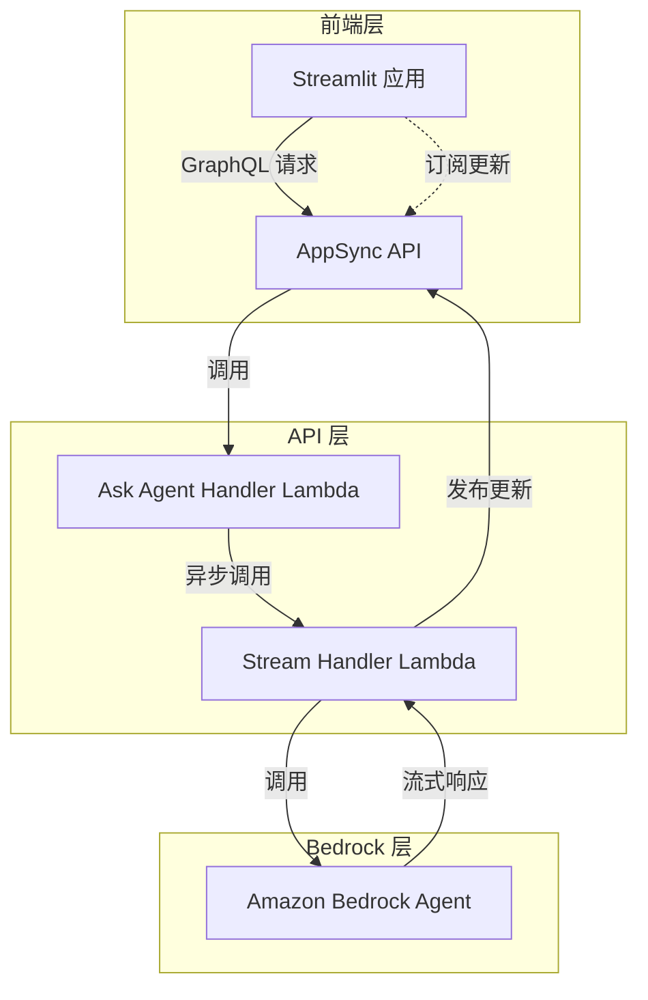

# Capsule 项目文档

## 架构文档

本目录包含 Capsule 项目的架构文档，帮助开发者和用户理解系统的设计和工作原理。

### 文档索引

1. [架构概述](architecture_overview.md) - 简洁的系统架构概述，适合快速了解
2. [详细架构](architecture.md) - 完整的系统架构文档，包含详细的组件说明和数据流程
3. [组件关系图](component_diagram.md) - 使用多种图表展示系统组件之间的关系和交互
4. [技术实现细节](implementation_details.md) - 详细描述关键组件的技术实现

## 项目概述

Capsule 是一个用于包装 Amazon Bedrock Agent 的解决方案，它在 Streamlit 前端和 Amazon Bedrock 之间添加了一个 GraphQL API 层，使前端能够与不同的 Bedrock agents 进行交互。该项目提供了一个完整的堆栈，包括认证、API 层和前端界面，支持 Agent 响应的实时流式传输。

## 主要特性

- **GraphQL API 层**：使用 AWS AppSync 提供 GraphQL 接口
- **实时流式响应**：通过 GraphQL 订阅实现实时流式传输
- **安全认证**：集成 Amazon Cognito 用户池
- **灵活部署**：支持本地或 ECS Fargate 部署
- **可扩展性**：易于扩展和定制

## 快速链接

- [项目主页](../README.md)
- [配置文件](../config.yml)
- [Streamlit 应用](../streamlit_app/app.py)

## 架构图预览

