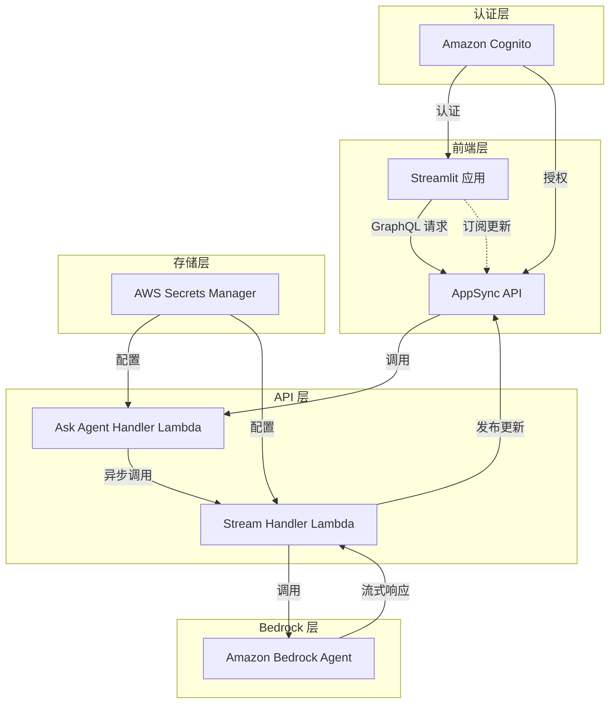
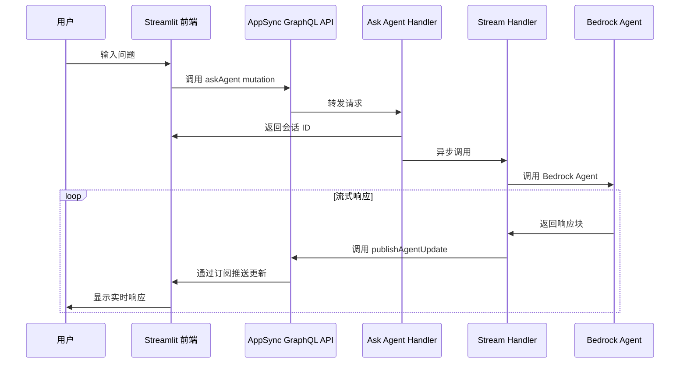
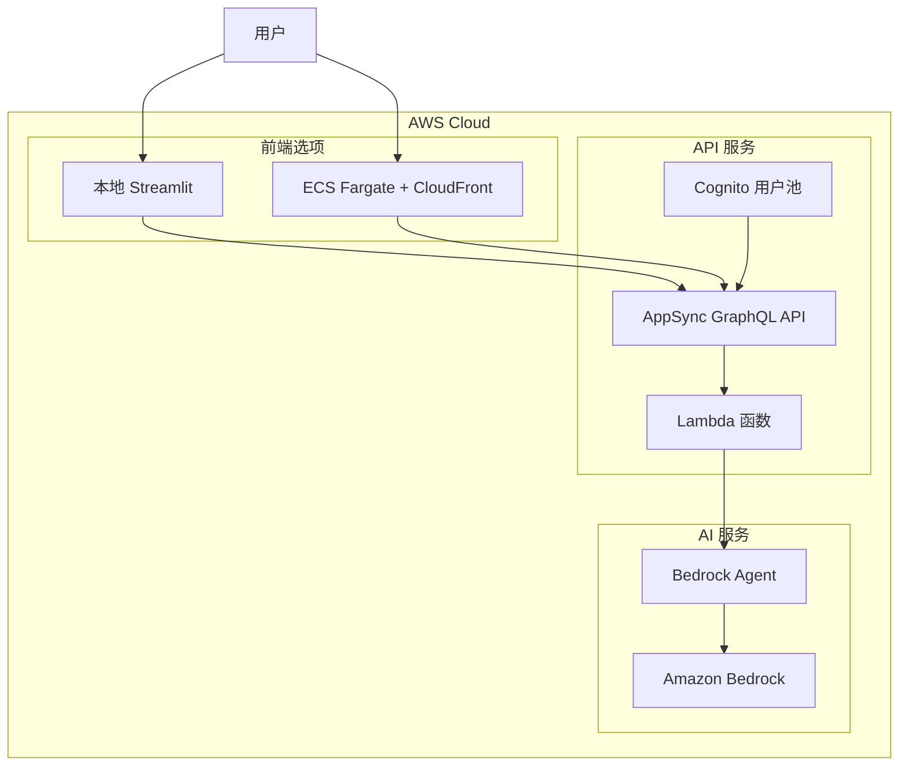
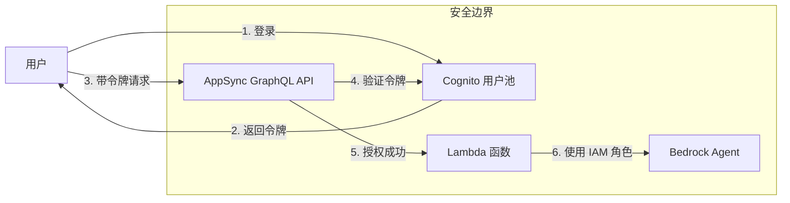

# Capsule 项目架构文档

## 项目概述

Capsule 是一个用于包装 Amazon Bedrock Agent 的解决方案，它在 Streamlit 前端和 Amazon Bedrock 之间添加了一个 GraphQL API 层，使前端能够与不同的 Bedrock agents 进行交互。该项目提供了一个完整的堆栈，包括认证、API 层和前端界面，支持 Agent 响应的实时流式传输。

## 系统架构

### 架构图

### 组件说明

1. **前端层**

   - **Streamlit 应用**：用户界面，可以部署在本地或 ECS Fargate 上
   - 通过 GraphQL 发送查询并订阅实时更新

2. **API 层**

   - **AppSync GraphQL API**：提供 GraphQL 接口，支持查询、变更和订阅
   - **Ask Agent Handler Lambda**：处理用户问题并异步触发流处理
   - **Stream Handler Lambda**：与 Bedrock Agent 交互并处理流式响应

3. **认证层**

   - **Amazon Cognito**：提供用户认证和授权
   - 支持多因素认证和 OAuth 流程

4. **Bedrock 层**

   - **Amazon Bedrock Agent**：AI 代理，处理用户查询并生成响应

5. **存储层**
   - **AWS Secrets Manager**：存储配置和敏感信息

## 数据流程

## 技术组件详解

### GraphQL Schema

GraphQL API 定义了以下主要操作：

- **Mutation**

  - `askAgent`: 向 Bedrock Agent 发送问题
  - `publishAgentUpdate`: 发布 Agent 响应更新

- **Subscription**
  - `onAgentResponse`: 订阅特定会话的 Agent 响应更新

### Lambda 函数

1. **Ask Agent Handler**

   - 接收用户问题
   - 生成唯一会话 ID
   - 异步调用 Stream Handler
   - 立即返回会话 ID 给前端

2. **Stream Handler**
   - 调用 Bedrock Agent API
   - 处理流式响应
   - 解析和格式化 Agent 输出
   - 通过 GraphQL API 发布更新

## 部署架构

## 安全架构

## 扩展性考虑

该架构设计具有良好的扩展性，可以通过以下方式进行扩展：

1. **多 Agent 支持**：可以轻松配置多个 Bedrock Agents
2. **自定义处理逻辑**：可以修改 Stream Handler 以实现自定义的响应处理
3. **前端定制**：Streamlit 应用可以根据需求进行定制
4. **集成其他服务**：可以集成其他 AWS 服务，如 S3 用于文件存储、DynamoDB 用于会话历史等

## 部署流程

1. 配置 `config.yml` 文件，指定 Bedrock Agent ID 和部署选项
2. 使用 AWS CDK 部署堆栈
3. 配置 Cognito 回调 URL
4. 访问应用程序 URL 或在本地运行 Streamlit 应用

## 结论

Capsule 项目提供了一个完整的解决方案，用于将 Amazon Bedrock Agent 包装为一个具有现代前端界面的应用程序。通过使用 GraphQL API 和流式处理，它实现了实时响应和良好的用户体验。该架构的模块化设计使其易于扩展和定制，适用于各种 AI 助手应用场景。
