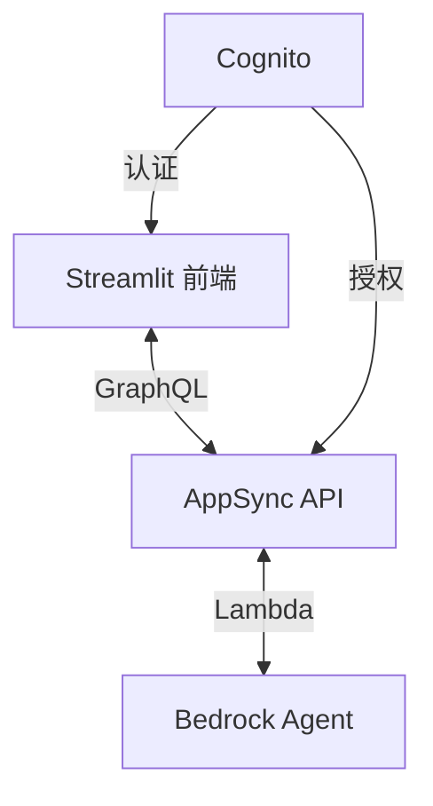
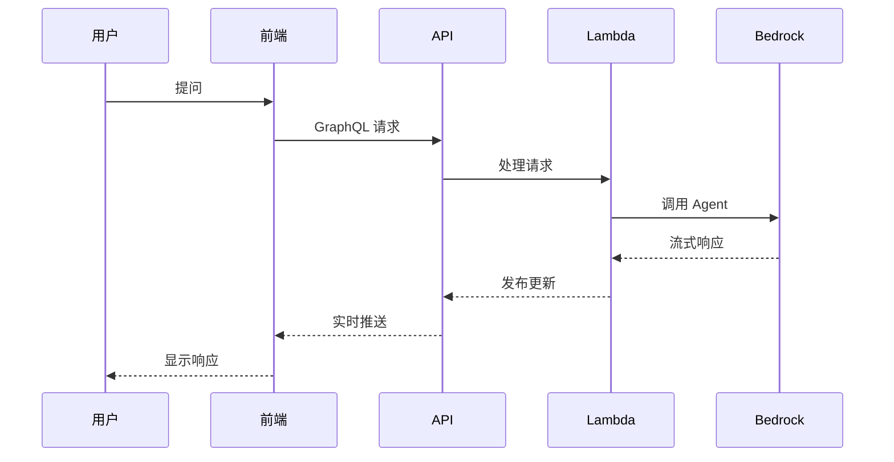

# Capsule 项目架构概述

## 核心架构

Capsule 项目是一个连接 Streamlit 前端与 Amazon Bedrock Agent 的中间层解决方案，采用 GraphQL API 实现实时流式通信。

## 关键组件

1. **前端**：Streamlit 应用，可部署在本地或 ECS Fargate
2. **API 层**：AppSync GraphQL API，支持查询、变更和订阅
3. **处理层**：两个 Lambda 函数
   - Ask Agent Handler：处理初始请求
   - Stream Handler：处理流式响应
4. **认证层**：Amazon Cognito 用户池
5. **AI 服务**：Amazon Bedrock Agent

## 数据流简图

## 部署选项

1. **本地部署**：

   - API 层部署在 AWS 云上
   - Streamlit 前端在本地运行

2. **云端部署**：
   - API 层部署在 AWS 云上
   - Streamlit 前端部署在 ECS Fargate 上
   - 通过 CloudFront 分发

## 技术栈

- **前端**：Streamlit
- **API**：AWS AppSync (GraphQL)
- **计算**：AWS Lambda
- **认证**：Amazon Cognito
- **AI**：Amazon Bedrock
- **IaC**：AWS CDK (Python)
- **配置**：AWS Secrets Manager

## 安全特性

- Cognito 用户认证
- GraphQL API 授权
- IAM 角色和策略
- 多因素认证支持

## 扩展点

- 支持多个 Bedrock Agents
- 自定义响应处理逻辑
- 前端界面定制
- 集成其他 AWS 服务
