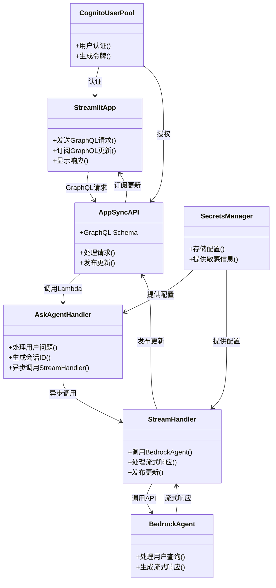
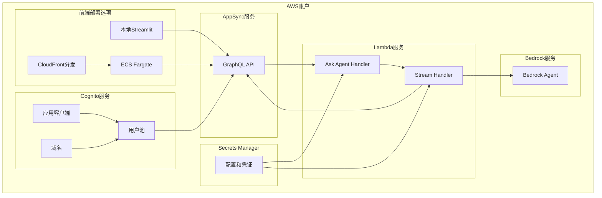
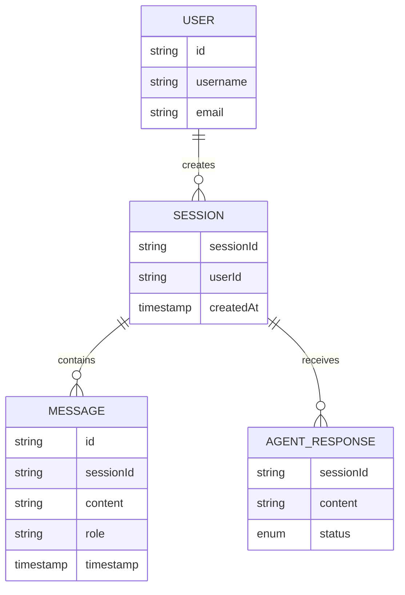
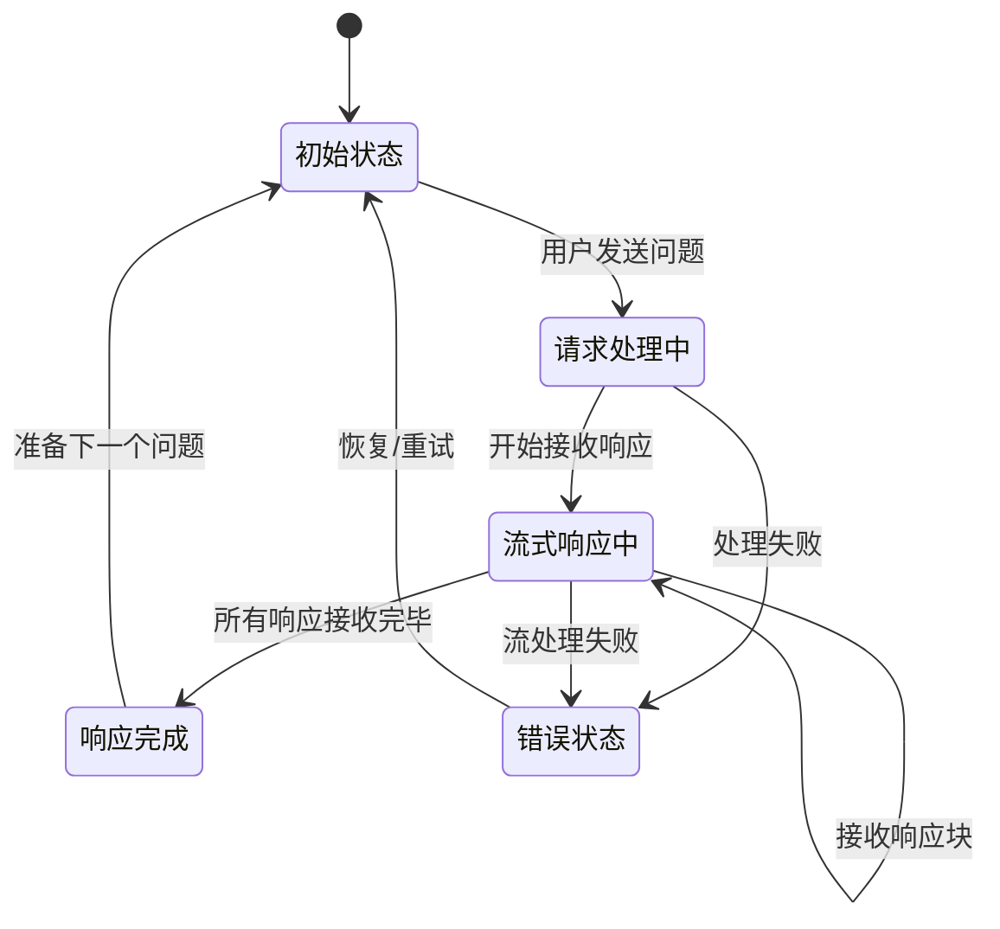
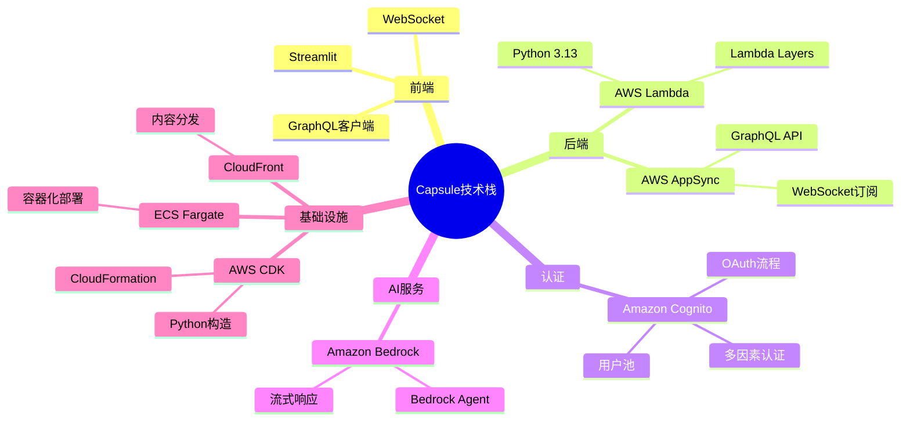

# Capsule 项目组件关系图

## 系统组件关系

以下图表展示了 Capsule 项目中各组件之间的详细关系和交互方式。

```mermaid
classDiagram
    class StreamlitApp {
        +发送GraphQL请求()
        +订阅GraphQL更新()
        +显示响应()
    }

    class AppSyncAPI {
        +GraphQL Schema
        +处理请求()
        +发布更新()
    }

    class AskAgentHandler {
        +处理用户问题()
        +生成会话ID()
        +异步调用StreamHandler()
    }

    class StreamHandler {
        +调用BedrockAgent()
        +处理流式响应()
        +发布更新()
    }

    class BedrockAgent {
        +处理用户查询()
        +生成流式响应()
    }

    class CognitoUserPool {
        +用户认证()
        +生成令牌()
    }

    class SecretsManager {
        +存储配置()
        +提供敏感信息()
    }

    StreamlitApp --> AppSyncAPI : GraphQL请求
    AppSyncAPI --> StreamlitApp : 订阅更新
    AppSyncAPI --> AskAgentHandler : 调用Lambda
    AskAgentHandler --> StreamHandler : 异步调用
    StreamHandler --> BedrockAgent : 调用API
    BedrockAgent --> StreamHandler : 流式响应
    StreamHandler --> AppSyncAPI : 发布更新
    CognitoUserPool --> StreamlitApp : 认证
    CognitoUserPool --> AppSyncAPI : 授权
    SecretsManager --> AskAgentHandler : 提供配置
    SecretsManager --> StreamHandler : 提供配置
```

## 部署组件关系

以下图表展示了 Capsule 项目的部署组件及其关系。

```mermaid
graph TB
    subgraph "AWS账户"
        subgraph "AppSync服务"
            api[GraphQL API]
        end

        subgraph "Lambda服务"
            ask[Ask Agent Handler]
            stream[Stream Handler]
        end

        subgraph "Cognito服务"
            userpool[用户池]
            client[应用客户端]
            domain[域名]
        end

        subgraph "Bedrock服务"
            agent[Bedrock Agent]
        end

        subgraph "Secrets Manager"
            secrets[配置和凭证]
        end

        subgraph "前端部署选项"
            local[本地Streamlit]
            fargate[ECS Fargate]
            cf[CloudFront分发]
        end
    end

    api --> ask
    ask --> stream
    stream --> agent
    stream --> api
    userpool --> api
    client --> userpool
    domain --> userpool
    secrets --> ask
    secrets --> stream

    local --> api
    fargate --> api
    cf --> fargate
```

## 数据模型

```mermaid
erDiagram
    USER {
        string id
        string username
        string email
    }

    SESSION {
        string sessionId
        string userId
        timestamp createdAt
    }

    MESSAGE {
        string id
        string sessionId
        string content
        string role
        timestamp timestamp
    }

    AGENT_RESPONSE {
        string sessionId
        string content
        enum status
    }

    USER ||--o{ SESSION : creates
    SESSION ||--o{ MESSAGE : contains
    SESSION ||--o{ AGENT_RESPONSE : receives
```

## 状态转换图

以下图表展示了消息处理的状态转换流程。

```mermaid
stateDiagram-v2
    [*] --> 初始状态
    初始状态 --> 请求处理中 : 用户发送问题
    请求处理中 --> 流式响应中 : 开始接收响应
    流式响应中 --> 流式响应中 : 接收响应块
    流式响应中 --> 响应完成 : 所有响应接收完毕
    响应完成 --> 初始状态 : 准备下一个问题

    请求处理中 --> 错误状态 : 处理失败
    流式响应中 --> 错误状态 : 流处理失败
    错误状态 --> 初始状态 : 恢复/重试
```

## 技术栈关系

```mermaid
mindmap
  root((Capsule技术栈))
    前端
      Streamlit
      GraphQL客户端
      WebSocket
    后端
      AWS AppSync
        GraphQL API
        WebSocket订阅
      AWS Lambda
        Python 3.13
        Lambda Layers
    认证
      Amazon Cognito
        用户池
        OAuth流程
        多因素认证
    AI服务
      Amazon Bedrock
        Bedrock Agent
        流式响应
    基础设施
      AWS CDK
        Python构造
        CloudFormation
      ECS Fargate
        容器化部署
      CloudFront
        内容分发
```
